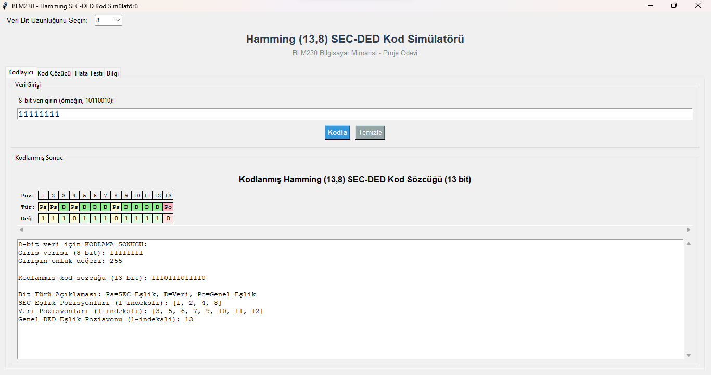

# Hamming Kodu SEC-DED Simülatörü

Bu proje, Hamming SEC-DED (Single Error Correction - Double Error Detection) kodlama algoritmasını gösteren Python tabanlı bir simülatördür. Uygulama, 8, 16 ve 32-bit veri girişlerini işleyebilen bir Grafik Kullanıcı Arayüzü (GUI) sunar. Kullanıcıların Hamming kodlarının dijital veri iletimindeki hataları nasıl algılayıp düzeltebildiğini (tek hata) veya tespit edebildiğini (çift hata) görsel ve etkileşimli bir şekilde anlamalarını amaçlar.
## Ekran Görüntüsü


## Özellikler

-   **SEC-DED Kodlama:** Verilen ikili veriyi (8, 16 veya 32 bit) Hamming SEC-DED şemasına göre kodlar.
-   **Hata Simülasyonu:** Kodlanmış veri üzerinde isteğe bağlı olarak tek veya çift bitlik hatalar oluşturulabilir (GUI'nin "Hata Testi" sekmesi aracılığıyla).
-   **Hata Algılama ve Düzeltme:**
    -   Tek bitlik hataları otomatik olarak algılar ve düzeltir.
    -   Çift bitlik hataları algılar (ancak düzeltemez).
    -   Genel eşlik bitindeki hataları algılar ve düzeltir.
-   **Etkileşimli GUI:** Kullanıcı dostu bir arayüz (Tkinter ile oluşturulmuştur) üzerinden veri girişi, kodlama, hata simülasyonu ve kod çözme işlemleri gerçekleştirilir.
-   **Detaylı Geri Bildirim:** Kodlama ve kod çözme adımları, eşlik bitleri, hata pozisyonları ve sonuçlar hakkında ayrıntılı bilgi sunar.
-   **Desteklenen Veri Boyutları:** 8-bit, 16-bit ve 32-bit veri uzunluklarını destekler.

## Demo Videosu

Hamming Kodu Simülatörünü çalışırken izleyin:

[youtube Videosu](https://youtu.be/f2LhJgN_AvA)

## Gereksinimler

-   Python 3.6 veya üstü
-   Ek bağımlılık gerekmez (yalnızca Python standart kütüphanelerini kullanır: `tkinter`, `random`, `math`).

## Kurulum

1.  Bu depoyu klonlayın (veya dosyaları indirin):
    ```bash
    git clone <repository-url>
    cd Hamming-Simulator 
    ```
    *(Not: `Hamming-Simulator` yerine kendi depo klasör adınızı kullanın)*

2.  Simülatörü çalıştırın:
    ```bash
    python main.py
    ```

## Nasıl Kullanılır

1.  **Uygulamayı Başlatın:** Yukarıdaki kurulum adımında belirtildiği gibi `python main.py` komutunu çalıştırın.
2.  **Veri Biti Uzunluğunu Seçin:** GUI'nin üst kısmındaki "Veri Bit Uzunluğunu Seçin:" açılır menüsünden 8, 16 veya 32 bit seçeneklerinden birini seçin.
3.  **Veri Girişi ("Kodlayıcı" Sekmesi):**
    -   "Veri Girişi" bölümündeki metin kutusuna, seçtiğiniz uzunlukta ikili verinizi girin (örneğin, 8-bit için `10110010`).
    -   "Kodla" butonuna tıklayın.
    -   "Kodlanmış Sonuç" bölümünde, kod sözcüğünün bitlerini (Poz: Pozisyon, Tür: Veri/Eşlik, Değ: Değer) ve altında daha detaylı kodlama bilgilerini (giriş verisi, onluk değeri, kodlanmış sözcük, bit türü açıklamaları, eşlik ve veri pozisyonları) göreceksiniz.
    -   "Temizle" butonu ile giriş ve çıkış alanlarını temizleyebilirsiniz.
4.  **Hata Simülasyonu ve Kod Çözme ("Hata Testi" Sekmesi):**
    -   Bu sekme, kodlanmış veriye hata ekleyip kod çözme işlemini test etmenizi sağlar.
    -   Genellikle bir "Hata Ekle" veya "Simüle Et" butonu ve ardından "Kod Çöz" butonu bulunur.
    -   Tek veya çift bit hatası seçme seçenekleri olabilir.
    -   Sonuçlar, hatanın tespit edilip edilmediğini, düzeltilip düzeltilemediğini ve düzeltilmiş veriyi gösterir.
5.  **Diğer Sekmeler:**
    -   **"Kod Çözücü" Sekmesi:** Harici bir Hamming kodlu veriyi girip çözmek için kullanılabilir.
    -   **"Bilgi" Sekmesi:** Uygulama veya Hamming kodları hakkında genel bilgiler içerebilir.

## Örnek Kullanım (GUI Üzerinden)

Aşağıdaki ekran görüntüsü, simülatörün "Kodlayıcı" sekmesindeki tipik bir kullanımını göstermektedir:



Bu örnekte:
-   8-bit veri uzunluğu seçilmiştir.
-   `11111111` verisi girilmiştir.
-   "Kodla" butonuna tıklandıktan sonra, 13-bitlik SEC-DED kodlanmış sözcük (`1110111011110`) ve ilgili tüm detaylar (eşlik bitleri, pozisyonları vb.) gösterilmiştir.

## Nasıl Çalışır

Hamming SEC-DED kodu, veriye fazladan eşlik (parity) bitleri ekleyerek çalışır. Bu simülatör aşağıdaki adımları uygular:

1.  **Parametre Hesaplama:**
    -   Verilen `k` veri biti sayısı (8, 16 veya 32) için, tek hata düzeltme (SEC) için gereken eşlik biti sayısı (`p_sec`) hesaplanır: `(2^p_sec) >= (k + p_sec + 1)`.
    -   Çift hata tespiti (DED) için bir adet genel eşlik biti eklenir. Toplam eşlik biti sayısı `p_ded = p_sec + 1` olur.
    -   Toplam kod sözcüğü uzunluğu `n = k + p_ded` olur.

2.  **Kodlama (`encode`):**
    -   Veri bitleri, kod sözcüğündeki belirlenmiş pozisyonlarına yerleştirilir.
    -   SEC eşlik bitleri (P1, P2, P4, ...) hesaplanır. Her bir SEC eşlik biti, kod sözcüğündeki belirli pozisyonların XOR toplamıdır.
    -   Genel eşlik biti, kod sözcüğündeki diğer tüm bitlerin (veri + SEC eşlik bitleri) XOR toplamı olarak hesaplanır ve kod sözcüğünün sonuna eklenir.

3.  **Kod Çözme ve Hata Yönetimi (`decode`):**
    -   **Sendrom Hesaplama:** Alınan kod sözcüğündeki SEC eşlik bitleri yeniden hesaplanır ve alınan eşlik bitleriyle karşılaştırılır. Farklılıklar (sendrom), olası bir hatanın pozisyonunu gösterir.
    -   **Genel Eşlik Kontrolü:** Alınan kod sözcüğündeki tüm bitlerin (genel eşlik biti hariç) XOR toplamı hesaplanır ve alınan genel eşlik bitiyle karşılaştırılır.
    -   Hata Durumları:
        -   **Sendrom = 0, Genel Eşlik Doğru:** Hata yok.
        -   **Sendrom != 0, Genel Eşlik Yanlış:** Tek bitlik hata tespit edildi. Sendrom değeri hata pozisyonunu verir ve bit düzeltilir.
        -   **Sendrom != 0, Genel Eşlik Doğru:** Çift bitlik hata tespit edildi. Bu tür hatalar düzeltilemez.
        -   **Sendrom = 0, Genel Eşlik Yanlış:** Genel eşlik bitinde tek bitlik hata tespit edildi ve düzeltildi.


